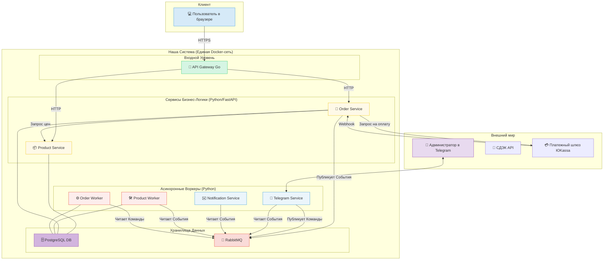

# Full-Stack E-commerce Платформа "rimmiq"

## 1. О проекте

`rimmiq` — это full-stack e-commerce платформа, разработанная с нуля. Проект представляет собой полноценный интернет-магазин с уникальной функцией — **конструктором кастомных сумок**, позволяющим пользователям в реальном времени создавать персонализированный продукт.

**Статус проекта:** Проект является частной коммерческой инициативой, находящейся в активной разработке. В связи с этим, исходный код представляет собой коммерческую тайну и не может быть опубликован. Этот репозиторий служит профессиональной витриной, демонстрирующей архитектуру, реализованный функционал и используемый технологический стек. 

## 2. Демонстрация работы

#### Стандартный e-commerce цикл

Платформа реализует полный и привычный для пользователя цикл покупки: от просмотра каталога до страницы оформления заказа. 
Так как сайт находится на стадии разработки, большинство изображений отсутствуют.

  

## 3. Решаемая бизнес-проблема

Проект был разработан для решения ключевых проблем малого авторского бренда, стремящегося уйти от зависимости от маркетплейсов:

*   **Высокие комиссии и отсутствие контроля:** Маркетплейсы забирают значительный процент от прибыли и не позволяют выстраивать прямую коммуникацию с клиентом.
*   **Размытие бренда:** На общей витрине маркетплейса невозможно передать уникальную историю и ценности бренда.
*   **Ограниченный функционал:** Отсутствие возможности предложить клиентам уникальный опыт, такой как создание кастомного продукта.

`rimmiq` решает эти проблемы, предоставляя бренду собственный, полностью контролируемый канал продаж с уникальным функционалом и возможностью выстраивать долгосрочные отношения с клиентами.

## 4. Архитектура и технические решения

Проект построен на отказоустойчивой, событийно-ориентированной микросервисной архитектуре. Все компоненты полностью контейнеризированы с помощью Docker и взаимодействуют друг с другом через API-шлюз или брокер сообщений RabbitMQ.

*   **`API Gateway` (Go):** Единственная точка входа для фронтенда. Написан на Go для максимальной производительности, надежности и минимального потребления ресурсов. Маршрутизирует запросы к соответствующим внутренним сервисам.
*   **`Product Service` (Python, FastAPI):** "Источник правды" для всего, что касается товаров, компонентов, их остатков и цен.
*   **`Order Service` (Python, FastAPI):** Управляет полным жизненным циклом заказов: от создания и расчета стоимости до списания остатков и обновления статусов. Оркестрирует взаимодействие с другими сервисами.
*   **`Notification Service` (Python):** Асинхронный сервис, который подписывается на события из RabbitMQ (например, `order_paid`) и отвечает за отправку email-уведомлений клиентам.
*   **`Telegram Service` (Python, Aiogram):** Панель управления для администратора. Асинхронно получает уведомления о новых заказах и позволяет управлять ими (например, отметить заказ как "отправленный"), отправляя команды обратно в систему через RabbitMQ.
*   **`Database` (PostgreSQL):** Центральная база данных с полной изоляцией схем по принципу **Schema per Service** для предотвращения конфликтов и обеспечения независимости разработки.
*   **`Message Broker` (RabbitMQ):** "Нервная система" проекта. Реализована четкая топология:
    *   **`events_exchange` (fanout):** Для широковещательных событий (`order_paid`), на которые могут подписаться несколько сервисов.
    *   **`commands_exchange` (direct):** Для адресных команд (`ship_order`), которые должен выполнить один конкретный сервис.

## 5. Технологический стек

*   **Языки:** Go, Python, TypeScript, SQL
*   **Backend:** FastAPI, Aiogram
*   **Frontend:** React, Zustand, Swiper
*   **Базы данных и брокеры:** PostgreSQL, RabbitMQ
*   **Инфраструктура и DevOps:** Docker, Docker Compose, Nginx
*   **Библиотеки:** SQLAlchemy (с Alembic для миграций)
